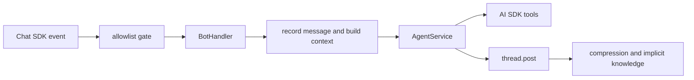
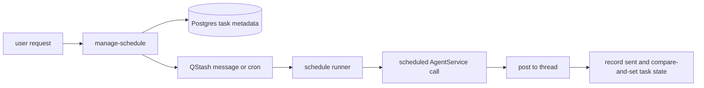

# @labjm/agent

Custom AI agent. Provide Telegram bot credentials to deploy the agent and receive messages on Telegram.

## Features

- **Local TUI** — terminal chat UI for testing the agent locally
- **Telegram bot** — webhook endpoint for direct messages, mentions, and subscribed threads
- **Memory** — PostgreSQL-backed chat state and agent memory
- **Knowledge** — hierarchical durable notes with hybrid retrieval and atomic corrections
- **Scheduling** — one-time and recurring reminders delivered through QStash
- **Google integration** — Calendar management and strictly read-only Gmail access through one OAuth connection
- **Nutrition tracking** — photo/text meal estimates, explicit confirmation, and daily calorie/macro progress

## How The Agent Works

Request lifecycle:



Scheduled-task lifecycle:



Core modules:

- `src/app/bot` owns Chat SDK wiring and inbound message handling.
- `src/app/attachments` validates current inbound files and normalizes images for model input.
- `src/app/agent` owns the AI SDK agent, prompt, and tool registry.
- `src/app/memory` owns short-term transcripts, rolling summaries, and context assembly.
- `src/app/knowledge` owns durable tree notes, retrieval, and implicit ingestion.
- `src/app/features/nutrition` owns calorie goals, meal estimation workflows, and daily totals.
- `src/app/schedules` owns schedule creation, cancellation, execution, and recovery.
- `src/infrastructure/*` wraps provider HTTP clients, DB, QStash, logging, and app errors.

Incoming attachments are ephemeral. The agent accepts up to three files per message, with a 7 MB limit per file. JPEG, PNG, and WebP images are limited to 40 decoded megapixels, resized within 1536x1536, and stripped of metadata. PDFs, videos, and other files are passed through as current-turn model file inputs. Original attachment bytes are not persisted by the application.

Nutrition estimates follow `photo/text -> draft -> explicit confirmation -> daily totals`. PostgreSQL is the source of truth for goals and confirmed meals; conversational memory is not used as the nutrition ledger. Corrections replace the structured meal estimate, and deletion is soft so totals remain auditable.

Scheduling states:

- Tasks are `active`, `paused`, `completed`, `cancelled`, or `failed`.
- Runs are claimed as `running`, then marked `sent`, `failed`, or `skipped`; an occurrence completed early by the user is marked `satisfied`.
- Recurring active tasks advance `nextRunAt`; one-time active tasks complete after a sent run.
- The runner regenerates same-occurrence edits against the latest revision, skips cancelled or rescheduled occurrences, and fences stale workers with per-attempt claim tokens.
- Post-send reconciliation advances the delivered occurrence without overwriting a newer cancellation or reschedule.
- A satisfied one-time occurrence completes without delivery. A satisfied recurring occurrence skips only that delivery and advances normally when QStash invokes it.
- Paused tasks keep their metadata but have no active QStash trigger until resumed.
- QStash owns delivery timing. Postgres owns task metadata, limits, and cancellation state.

Working conventions:

- Keep provider SDKs and database tables behind infrastructure services.
- Use static service classes for app-owned domain modules, but keep framework edge files simple.
- Put shared schemas/types in nearby `schemas.ts` or `types.ts`; keep file-local helper types below runtime code.
- Prefer changing public module methods and tests over reaching through implementation details.

## Environment

```sh
cp .env.local.example .env.local
```

Fill the provider and integration keys:

- `OPENAI_API_KEY`
- `TELEGRAM_BOT_TOKEN`
- `TELEGRAM_WEBHOOK_SECRET_TOKEN`
- `TELEGRAM_ALLOWED_USER_IDS` — optional comma-separated Telegram numeric user IDs allowed to use the bot
- `BLOOIO_API_KEY`
- `BLOOIO_FROM_NUMBER`
- `BLOOIO_WEBHOOK_SECRET`
- `IMESSAGE_ALLOWED_NUMBERS` — optional comma-separated E.164 phone numbers allowed to use the iMessage agent
- `DATABASE_URL`
- `QSTASH_CURRENT_SIGNING_KEY`
- `QSTASH_NEXT_SIGNING_KEY`

## Development

From the repo root:

```sh
pnpm dev
```

This starts the agent TUI alongside the other workspace apps.

To run only the agent:

```sh
pnpm --filter @labjm/agent dev
```

The agent webhook server is available through:

```sh
pnpm --filter @labjm/agent dev:server
```

Health check:

```sh
curl http://localhost:2000/health
```

Telegram webhook endpoint:

```txt
POST /webhooks/telegram
```

Blooio iMessage webhook endpoint:

```txt
POST /webhooks/imessage
```

Configure the Blooio webhook to send signed events to this endpoint. The adapter verifies them
with `BLOOIO_WEBHOOK_SECRET`.

To restrict iMessage access, set `IMESSAGE_ALLOWED_NUMBERS`:

```sh
IMESSAGE_ALLOWED_NUMBERS="+48123456789,+48987654321"
```

Leave it empty to allow all iMessage numbers.

To restrict bot usage during development, set `TELEGRAM_ALLOWED_USER_IDS`:

```sh
TELEGRAM_ALLOWED_USER_IDS="123456789,987654321"
```

Leave it empty to allow all Telegram users.

World Cup polling endpoint, called by QStash schedules:

```txt
GET /jobs/world-cup/events
```

The shared QStash infrastructure adapter verifies the raw request body and `upstash-signature` header with `QSTASH_CURRENT_SIGNING_KEY` and `QSTASH_NEXT_SIGNING_KEY`.

The schedule window is every minute from 17:45 through 09:59 the next day in `Europe/Warsaw`:

```txt
CRON_TZ=Europe/Warsaw 45-59 17 * * *
CRON_TZ=Europe/Warsaw * 18-23 * * *
CRON_TZ=Europe/Warsaw * 0-9 * * *
```

## Deployment to Vercel

The agent is deployed as a Vercel Node function from the `apps/agent` workspace package. The Vercel project must use:

- **Root Directory**: `apps/agent`
- **Build Command**: `pnpm build`
- **Output Directory**: `dist`
- **Database**: Neon Postgres via `DATABASE_URL`

`vercel.json` already defines the build/output settings and rewrites all traffic to the Hono app entrypoint.

### 1. Create the Neon database

Create a Neon Postgres project for the agent and use its connection string as `DATABASE_URL`.

Recommended setup:

- Use the Neon pooled connection string for Vercel runtime.
- Use the direct/unpooled connection string while applying migrations. If the URL uses
  `sslmode=require`, change it to `sslmode=verify-full` to preserve certificate verification and
  avoid the upcoming `pg` compatibility change.
- Keep all app tables in the `public` schema.
- Do not rely on `search_path` connection options; Neon pooled connections can reject unsupported startup parameters.

Before deploying the app, apply the committed Drizzle migrations to a new database:

```sh
pnpm --filter @labjm/agent db:migrate
```

The initial migration enables `pgvector` before creating the agent tables and vector index.

### 2. Configure Vercel environment variables

Set these in the Vercel project for the environments you deploy to:

Required:

- `DATABASE_URL` — Neon Postgres connection string
- `OPENAI_API_KEY`
- `TELEGRAM_BOT_TOKEN`
- `TELEGRAM_WEBHOOK_SECRET_TOKEN`
- `TELEGRAM_ALLOWED_USER_IDS` — optional comma-separated allowlist while the agent is private
- `TELEGRAM_BOT_USERNAME` — optional, defaults to `labjm_assistant_bot`
- `BLOOIO_API_KEY` — Blooio API key used by the iMessage provider
- `BLOOIO_FROM_NUMBER` — default Blooio sending number in E.164 format
- `BLOOIO_WEBHOOK_SECRET` — verifies signed Blooio webhook deliveries
- `IMESSAGE_ALLOWED_NUMBERS` — optional comma-separated E.164 allowlist while the agent is private
- `OPENWEATHER_API_KEY` — required for weather and local-time tools
- `QSTASH_CURRENT_SIGNING_KEY` — required for QStash-signed World Cup polling and scheduled-task execution
- `QSTASH_NEXT_SIGNING_KEY` — required for QStash-signed World Cup polling and scheduled-task execution
- `QSTASH_TOKEN` — required for creating QStash one-time messages and recurring schedules
- `AGENT_PUBLIC_URL` — stable public base URL used as the QStash scheduled-task destination, for example `https://agent.example.com`
- `GOOGLE_OAUTH_CLIENT_ID` — Google OAuth web application client id for Calendar and Gmail integration
- `GOOGLE_OAUTH_CLIENT_SECRET` — Google OAuth web application client secret
- `GOOGLE_OAUTH_REDIRECT_URI` — exact Google OAuth redirect URI, for example `https://agent.lab.jakubmisilo.com/links/google/callback`
- `GOOGLE_TOKEN_ENCRYPTION_KEY` — base64-encoded 32-byte key used to encrypt stored Google refresh tokens

Generate the Google token encryption key with:

```sh
openssl rand -base64 32
```

Enable both Google Calendar API and Gmail API in the same Google Cloud project. Configure the OAuth consent screen with the Calendar scopes used by the app and `https://www.googleapis.com/auth/gmail.readonly`. Use publishing status `In production` for durable refresh tokens; a personal unverified app will still show Google's warning screen.

Add the optional env vars the same way when those integrations are enabled.

### 3. Deploy

Preferred flow is git-connected Vercel deployment: merge/push to the production branch after the project is linked to Vercel.

Manual CLI deployment:

```sh
vercel --cwd apps/agent deploy --prod
```

### 4. Configure Telegram webhook

Point Telegram at the deployed agent URL:

```sh
curl -X POST "https://api.telegram.org/bot$TELEGRAM_BOT_TOKEN/setWebhook" \
  -d "url=https://<agent-domain>/webhooks/telegram" \
  -d "secret_token=$TELEGRAM_WEBHOOK_SECRET_TOKEN"
```

The `secret_token` must match `TELEGRAM_WEBHOOK_SECRET_TOKEN` in Vercel.

### 5. Configure Blooio webhook

Point the Blooio signed webhook at:

```txt
POST https://<agent-domain>/webhooks/imessage
```

The webhook secret must match `BLOOIO_WEBHOOK_SECRET` in Vercel.

### 6. Configure QStash schedules, if World Cup polling is enabled

Use QStash schedules that call:

```txt
GET https://<agent-domain>/jobs/world-cup/events
```

The route verifies QStash signatures with `QSTASH_CURRENT_SIGNING_KEY` and `QSTASH_NEXT_SIGNING_KEY`; it does not use a separate cron secret.

Current polling window:

```txt
CRON_TZ=Europe/Warsaw 45-59 17 * * *
CRON_TZ=Europe/Warsaw * 18-23 * * *
CRON_TZ=Europe/Warsaw * 0-9 * * *
```

Generic user scheduling does not need a periodic polling cron. The `manage-schedule` tool creates QStash delayed messages for one-time tasks and QStash schedules for recurring tasks. QStash calls:

```txt
POST https://<agent-domain>/jobs/schedules/execute
```

The route verifies QStash signatures with `QSTASH_CURRENT_SIGNING_KEY` and `QSTASH_NEXT_SIGNING_KEY`.

## Database

Drizzle-managed app tables live in the `public` PostgreSQL schema, including the temporary `world_cup_2026_*` tables. Schema changes use the checked-in migration workflow:

```sh
pnpm --filter @labjm/agent db:generate
pnpm --filter @labjm/agent db:migrate
```

Review every generated SQL file before committing it. CI migrates a fresh pgvector-enabled PostgreSQL database and runs the gated persistence suites. Chat SDK state tables remain owned by `@chat-adapter/state-pg` and are excluded through `tablesFilter`; do not add Drizzle ownership for `chat_state_*`.

## Stack

- [AI SDK](https://sdk.vercel.ai) — agent runtime and model calls
- [AI SDK TUI](https://sdk.vercel.ai) — local terminal UI
- [Chat SDK](https://www.npmjs.com/package/chat) — Telegram bot adapter and chat state
- [Hono](https://hono.dev) — webhook server
- [Drizzle](https://orm.drizzle.team) — PostgreSQL schema and migrations
